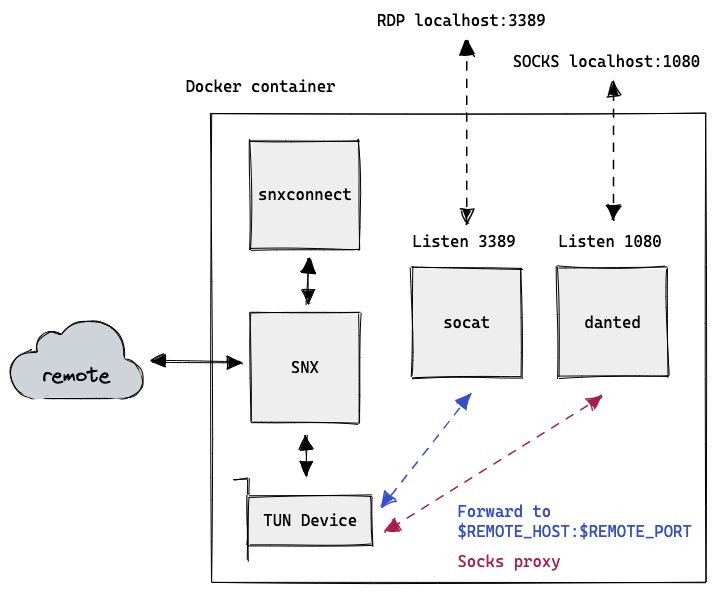

# SNX RDP Proxy

Sets up environment where [`snxconnect`](https://github.com/schlatterbeck/snxvpn) works.
Forwards incoming connections on port 3389 to `REMOTE_HOST` and hosts a SOCKS proxy on port 1080.

Usage:

- Create an `.env` file from the [example](./example.env)
- Start with

  ```sh
  docker run --rm --name snx -p 3389:3389 -p 1080:1080 --privileged -it --env-file .env goshaza/snx-rdp-proxy
  ```

- Fill in password (if not in .env)
- Fill in One-time code.  
  _Note that since snxvpn uses `getpass` the input not visible_.
- Connect with RDP to localhost:3389
- After you've confirmed it works you can type <kbd>Ctrl</kbd> + <kbd>P</kbd> <kbd>Ctrl</kbd> + <kbd>Q</kbd> in the terminal window to detach and leave it running in the background.
- Open a chrome instance with proxy set up with

  ```sh
  open -na "Google Chrome" --args --proxy-server=socks5://localhost:1080 --no-setup --user-data-dir=$HOME/proxy-user
  ```

## Notes

- Sometimes it won't accept the one-time code no matter how many times you enter it correctly.
  In that case it helps to go to the original access page, start a login, but press cancel when asked to enter the OTP.

- If it responds with "Unexpected response", that means it's _either_ the wrong username/password _or_ a temporary error.
  Double check the password, and/or try again.

## How it works

### Original

When installing normally, CheckPoint will download and install snx in the background.
It starts it in the background with `snx -Z`, and then passes configuration options over a local socket.
`snx` in turns sets up a tunnel device and proxies all relevant traffic though it, hence creating a VPN.


### Inside docker

Instead, https://github.com/schlatterbeck/snxvpn replaces the CheckPoint GUI.
Provided with username/password it logs into the access page to acquire the correct parameters to send to snx.

To expose RDP from inside docker, `socat` is used. It listens to connections on 3389 and forwards all traffic to `$REMOTE_HOST:$REMOTE_PORT`. When snx is up and running, that can be an RDP host on the remote network.



Note that you can install `snx`/`snxvpn` locally on your computer to get a VPN without the checkpoint client. On linux, you might have trouble getting the 32bit snx binary to run though.
There is however an `snx` darwin binary that should work on x64.
